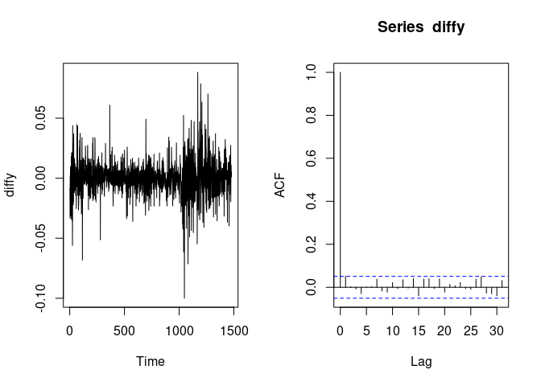
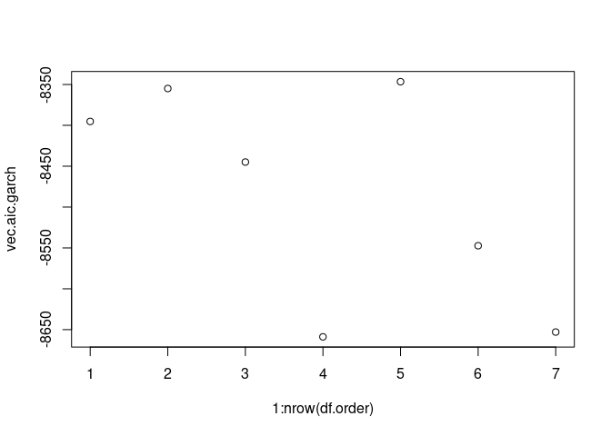
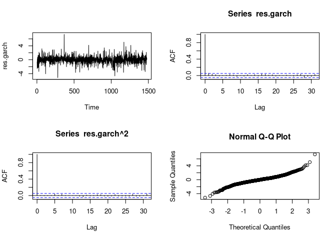

Heteroskedasticity
================

# Introduction

Heteroskedasticity means that the variance of the time series is
non-constant. It is a property commonly exhibited by stock data. For
heteroskedastic series, GARCH model should be used to fit the data
instead of ARIMA model to capture the non-constant variance. In this
notebook, we will compare the fit of two different model on HSBC stock
price on HKEX.

# Preprocessing

Import required libraries.

``` r
#install.packages("tseries")
#install.packages("forecast")
library(tseries)
```

    ## Registered S3 method overwritten by 'quantmod':
    ##   method            from
    ##   as.zoo.data.frame zoo

``` r
library(forecast)
```

Import and clean the stock data.

``` r
hsbc = get.hist.quote(instrument="0005.hk", start="2016-01-01", end="2021-12-31", quote=c("AdjClose"))
```

    ## 'getSymbols' currently uses auto.assign=TRUE by default, but will
    ## use auto.assign=FALSE in 0.5-0. You will still be able to use
    ## 'loadSymbols' to automatically load data. getOption("getSymbols.env")
    ## and getOption("getSymbols.auto.assign") will still be checked for
    ## alternate defaults.
    ## 
    ## This message is shown once per session and may be disabled by setting 
    ## options("getSymbols.warning4.0"=FALSE). See ?getSymbols for details.

    ## time series starts 2016-01-04
    ## time series ends   2021-12-30

``` r
hsbc[is.na(hsbc)==T] = mean(hsbc, na.rm=T)
y = as.numeric(log(hsbc))
par(mfrow=c(1,2))
ts.plot(y)
acf(y)
```

<!-- --> 

# ARIMA fitting 
The ACF plot shows that there is a trend within the time series. To
establish stationarity for further analysis, we can perform differencing
on the series.

``` r
diffy = as.numeric(diff(log(hsbc)))
par(mfrow=c(1,2))
ts.plot(diffy)
acf(diffy)
```

<!-- -->

From the ACF plot, we can see that for k \> 0, all ACF(k) is within the
confidence interval. This suggests ARIMA(0, 0, 0) should best fit the
differenced data. The hypothesis can be confirmed using auto ARIMA
fitting, showing that ARIMA(0, 1, 0) best fits the original data.

``` r
model.arima = auto.arima(y, ic="aicc")
model.arima
```

    ## Series: y 
    ## ARIMA(0,1,0) 
    ## 
    ## sigma^2 estimated as 0.0002056:  log likelihood=4179.46
    ## AIC=-8356.92   AICc=-8356.92   BIC=-8351.62

However, residual-squared of ARIMA(0, 0, 0) is not white noise. This
suggests that the residual is also not white noise. As the residual
still contains information, some other model should be used to capture
those information.

``` r
res.arima = model.arima$res
par(mfrow=c(1,2))
acf(res.arima)
acf(res.arima^2)
```

<!-- --> 

# GARCH fitting
Before fitting a GARCH model, we should test for GARCH effect using
Lagrange Multiplier test. Since p-value = 0 \< 0.05, we can reject null
hypothesis and conclude that that GARCH effect is significant.

``` r
n = length(res.arima)
res.sq.arima = res.arima^2
df.garch = data.frame(
rsq = res.sq.arima,
rsq1 = c(rep(0, 1), res.sq.arima[1:(n-1)]),
rsq2 = c(rep(0, 2), res.sq.arima[1:(n-2)]),
rsq3 = c(rep(0, 3), res.sq.arima[1:(n-3)]),
rsq4 = c(rep(0, 4), res.sq.arima[1:(n-4)])
)
model.garch.effect = lm(formula = rsq ~ ., data = df.garch)
summary(model.garch.effect)
```

    ## 
    ## Call:
    ## lm(formula = rsq ~ ., data = df.garch)
    ## 
    ## Residuals:
    ##        Min         1Q     Median         3Q        Max 
    ## -0.0008522 -0.0001651 -0.0001372 -0.0000267  0.0097987 
    ## 
    ## Coefficients:
    ##              Estimate Std. Error t value Pr(>|t|)    
    ## (Intercept) 1.501e-04  1.733e-05   8.660  < 2e-16 ***
    ## rsq1        7.378e-02  2.597e-02   2.841  0.00457 ** 
    ## rsq2        6.205e-02  2.599e-02   2.387  0.01710 *  
    ## rsq3        6.401e-02  2.599e-02   2.463  0.01391 *  
    ## rsq4        6.976e-02  2.597e-02   2.686  0.00731 ** 
    ## ---
    ## Signif. codes:  0 '***' 0.001 '**' 0.01 '*' 0.05 '.' 0.1 ' ' 1
    ## 
    ## Residual standard error: 0.0005592 on 1475 degrees of freedom
    ## Multiple R-squared:  0.0229, Adjusted R-squared:  0.02025 
    ## F-statistic: 8.642 on 4 and 1475 DF,  p-value: 6.806e-07

We can find the best GARCH(p, q) model by trying out combinations of p
and q and selecting the one which minimises AIC.

``` r
df.order <- data.frame(p = c(0, 1, 0, 1, 2, 1, 2), q = c(1, 0, 2, 1, 0, 2, 1))
vec.aic.garch = apply(df.order, 1,
function(order) {
  p <- order[1]; q <- order[2]
  AIC(garch(res.arima, order = c(p, q)))
} )
```

From the following plot, we can see that the 4th combination (1, 1)
minimises AIC.

``` r
par(mfrow = c(1, 1))
plot(1:nrow(df.order), vec.aic.garch)
```

<!-- -->

Therefore, we fit GARCH(1, 1) to the residual of the ARIMA fitting.

``` r
model.garch = garch(res.arima, order = c(1, 1))
```

    ## 
    ##  ***** ESTIMATION WITH ANALYTICAL GRADIENT ***** 
    ## 
    ## 
    ##      I     INITIAL X(I)        D(I)
    ## 
    ##      1     1.850413e-04     1.000e+00
    ##      2     5.000000e-02     1.000e+00
    ##      3     5.000000e-02     1.000e+00
    ## 
    ##     IT   NF      F         RELDF    PRELDF    RELDX   STPPAR   D*STEP   NPRELDF
    ##      0    1 -5.553e+03
    ##      1    8 -5.553e+03  3.90e-05  7.52e-05  4.6e-05  2.0e+10  4.6e-06  7.52e+05
    ##      2   16 -5.560e+03  1.34e-03  2.07e-03  4.1e-01  2.0e+00  6.9e-02  2.53e+00
    ##      3   19 -5.584e+03  4.24e-03  3.08e-03  6.9e-01  1.9e+00  2.8e-01  4.00e-01
    ##      4   21 -5.591e+03  1.31e-03  1.19e-03  7.6e-02  2.0e+00  5.5e-02  1.04e+02
    ##      5   23 -5.610e+03  3.36e-03  2.84e-03  1.2e-01  2.0e+00  1.1e-01  1.08e+04
    ##      6   25 -5.631e+03  3.64e-03  3.44e-03  8.9e-02  2.0e+00  9.8e-02  2.01e+06
    ##      7   27 -5.635e+03  7.31e-04  7.22e-04  1.6e-02  2.0e+00  2.0e-02  1.21e+04
    ##      8   37 -5.636e+03  2.56e-04  6.02e-04  3.9e-06  3.6e+00  4.7e-06  1.38e+03
    ##      9   38 -5.636e+03  1.88e-05  1.59e-05  3.7e-06  2.0e+00  4.7e-06  7.52e+02
    ##     10   39 -5.636e+03  6.61e-07  5.98e-07  3.8e-06  2.0e+00  4.7e-06  7.73e+02
    ##     11   48 -5.650e+03  2.40e-03  3.00e-03  5.8e-02  2.0e+00  7.7e-02  7.71e+02
    ##     12   49 -5.658e+03  1.43e-03  1.59e-03  5.1e-02  7.9e-01  7.7e-02  2.47e-03
    ##     13   51 -5.669e+03  1.96e-03  2.27e-03  8.5e-02  0.0e+00  1.9e-01  2.27e-03
    ##     14   63 -5.676e+03  1.25e-03  1.99e-03  1.5e-06  2.6e+00  2.7e-06  1.11e-02
    ##     15   64 -5.677e+03  7.76e-05  1.52e-04  1.2e-06  2.0e+00  2.7e-06  8.58e-03
    ##     16   65 -5.677e+03  2.05e-05  1.80e-05  1.2e-06  2.0e+00  2.7e-06  1.13e-02
    ##     17   66 -5.677e+03  3.35e-07  3.04e-07  1.2e-06  2.0e+00  2.7e-06  1.17e-02
    ##     18   75 -5.684e+03  1.27e-03  1.14e-03  1.9e-02  1.0e+00  4.5e-02  1.17e-02
    ##     19   77 -5.685e+03  2.62e-04  2.56e-04  3.7e-03  2.0e+00  8.9e-03  5.09e-01
    ##     20   79 -5.688e+03  5.05e-04  5.10e-04  7.3e-03  2.0e+00  1.8e-02  2.02e+00
    ##     21   80 -5.691e+03  5.12e-04  7.67e-04  1.4e-02  1.8e+00  3.6e-02  9.14e-03
    ##     22   82 -5.691e+03  4.68e-05  9.28e-05  3.3e-03  1.0e+00  7.0e-03  1.30e-04
    ##     23   84 -5.691e+03  1.20e-06  1.68e-05  5.1e-04  1.5e+00  1.1e-03  1.96e-05
    ##     24   85 -5.692e+03  6.74e-06  6.45e-06  2.2e-04  1.3e+00  5.7e-04  6.47e-06
    ##     25   86 -5.692e+03  1.23e-07  2.07e-07  1.1e-04  0.0e+00  2.2e-04  2.07e-07
    ##     26   88 -5.692e+03  1.25e-07  1.06e-07  1.4e-04  0.0e+00  3.7e-04  1.06e-07
    ##     27  102 -5.692e+03 -6.65e-14  6.22e-14  1.8e-14  1.7e+04  3.3e-14  1.14e-09
    ## 
    ##  ***** FALSE CONVERGENCE *****
    ## 
    ##  FUNCTION    -5.691511e+03   RELDX        1.756e-14
    ##  FUNC. EVALS     102         GRAD. EVALS      27
    ##  PRELDF       6.222e-14      NPRELDF      1.138e-09
    ## 
    ##      I      FINAL X(I)        D(I)          G(I)
    ## 
    ##      1    1.811773e-06     1.000e+00    -1.060e+04
    ##      2    3.874633e-02     1.000e+00    -1.052e+00
    ##      3    9.514124e-01     1.000e+00    -1.101e+00

``` r
summary(model.garch)
```

    ## 
    ## Call:
    ## garch(x = res.arima, order = c(1, 1))
    ## 
    ## Model:
    ## GARCH(1,1)
    ## 
    ## Residuals:
    ##     Min      1Q  Median      3Q     Max 
    ## -5.1494 -0.5448  0.0000  0.4979  7.2936 
    ## 
    ## Coefficient(s):
    ##     Estimate  Std. Error  t value Pr(>|t|)    
    ## a0 1.812e-06   3.275e-07    5.533 3.15e-08 ***
    ## a1 3.875e-02   4.063e-03    9.536  < 2e-16 ***
    ## b1 9.514e-01   5.145e-03  184.937  < 2e-16 ***
    ## ---
    ## Signif. codes:  0 '***' 0.001 '**' 0.01 '*' 0.05 '.' 0.1 ' ' 1
    ## 
    ## Diagnostic Tests:
    ##  Jarque Bera Test
    ## 
    ## data:  Residuals
    ## X-squared = 1112.5, df = 2, p-value < 2.2e-16
    ## 
    ## 
    ##  Box-Ljung test
    ## 
    ## data:  Squared.Residuals
    ## X-squared = 0.017096, df = 1, p-value = 0.896

The time series plot and ACF plots show that the residual of GARCH(1, 1)
is indeed white noise. Moreover, the residual is normally distributed
because normal quantile-quantile plot shows approximately a straight
line.

``` r
res.garch = residuals(model.garch)
res.garch = na.omit(res.garch)
par(mfrow = c(2, 2))
ts.plot(res.garch)
acf(res.garch)
acf(res.garch^2)
qqnorm(res.garch)
```

<!-- -->
